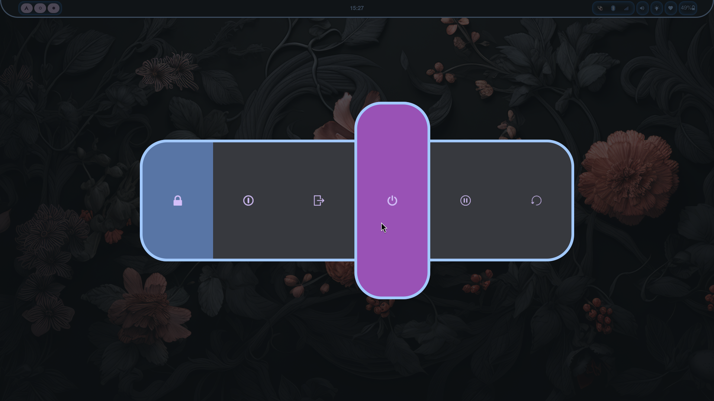

# THIS REPOSITORY HAS BEEN MOVED TO [MY SELF HOSTED GITEA SERVER](https://gitkeaz.keyonz.dev/Keyonz/KonfiZ)

# Konfiz

<!--toc:start-->
- [Konfiz](#konfiz)
  - [Screenshots](#screenshots)
  - [Requirements](#requirements)
  - [Installation](#installation)
  - [Usage](#usage)
  - [What's next ?](#whats-next)
<!--toc:end-->

README is outdated I am working on it :))

## Screenshots





## Requirements

Required :

- git
- stow
- hyprland
- hyprpaper
- hypridle
- hyprshot
- rofi-wayland
- wlogout
- swaync
- brightnessctl
- pipewire
- wireplumber
- alsa-utils
- pavucontrol
- NetworkManager
- network-manager-applet
- bluez
- blueman-applet
- cliphist
- waybar
- sddm
- xdg-desktop-portal-hyprland
- xwayland-video-bridge

Recommended (if you plan on using something else,please review the dotfiles and edit them accordingly) :

- zsh
- oh-my-posh
- kitty
- firefox
- vesktop
- nvim

## Installation

Installation has not been tested from a fresh install yet proceed at your own risk.
It is what I remember doing and what I would do from a fresh install.

This installation guide assume you have a minimal installation of Arch Linux. It also assume you have setup your graphics drivers correctly (especially for nivida gpu).

Make sure to install all the dependencies listed [above](#requirements).

Clone this repo and go into it (the folder containing the repo must be in your home folder here : `~/konfiz`) :

```bash
git clone https://gitkeaz.keyonz.dev/Keyonz/konfiz ~/konfiz && cd ~/konfiz
```

Setup all the dotfiles

```bash
stow .
```

It is now time to setup sddm, use these commands to make it ready for use.

```bash
sudo ln -s ~/konfiz/.config/sddm.conf.d/ /etc
sudo cp -r ~/konfiz/.config/sddm-custom-theme /usr/share/sddm/themes/
```

Now start the required sockets

```bash
sudo systemctl enable sddm
systemctl --user enable pipewire
```

If you don't have an nvidia gpu, comment the relevant lines in `.config/hypr/hyprland.conf`

Everything should be good to go after a reboot.
Remember that this installation guide has not been tested yet, you might need to debug some stuff.

## Usage

All keybindings are specified in `.config/hypr/keybinds.conf`

## What's next ?

This configuration is for now using catppuccin's color palette and cursors.
I plan on making my own cursor.

I also want to generate a color palette based on your wallpaper.

Grub, firefox, wallpaper and more things are still on my Todo list.
